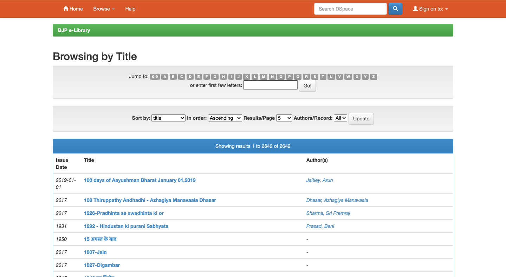
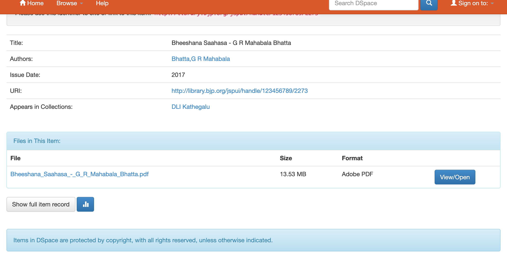
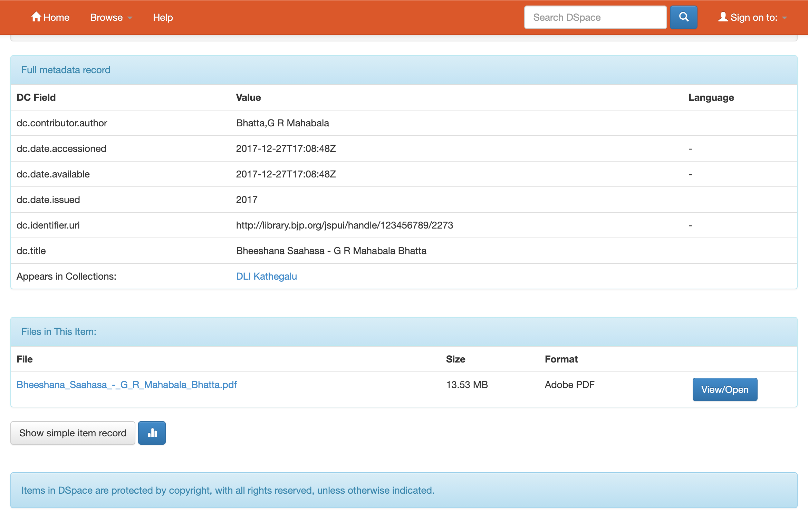

## BJP Central Library

### Books list page

#### Options selected when listing by title
- Sort by title
- In order Ascending
- Results/Page 2642  
(to get all results at once i.e. 2642, change in URL, not through web interface)
- Authors/Record: All

link is:  
http://library.bjp.org/jspui/browse?type=title&sort_by=1&order=ASC&rpp=2642&etal=-1&null=&offset=0



### Book record page

#### Simple metadata record(?mode=simple or with nothing)
http://library.bjp.org/jspui/handle/123456789/2273?mode=simple

1st table
- Title
- Authors (with authors page link)
- Issue Date 
- Book URI (with link)
- Collections (with collections link)

2nd table
- Downloadable book files per format



#### Full metadata record (?mode=full)
http://library.bjp.org/jspui/handle/123456789/2273?mode=full

1st table
- Authors
- Accession date
- Availability date
- Issue date
- URI
- Collections (with collections link)

2nd table
- Downloadable book files per format




#### Example of link to download a book file
http://library.bjp.org/jspui/bitstream/123456789/2273/1/Bheeshana_Saahasa_-_G_R_Mahabala_Bhatta.pdf

#### Run scrapy shell on local HTML file
```bash
scrapy shell ./file-path-from-scrapy-project-root-folder.html